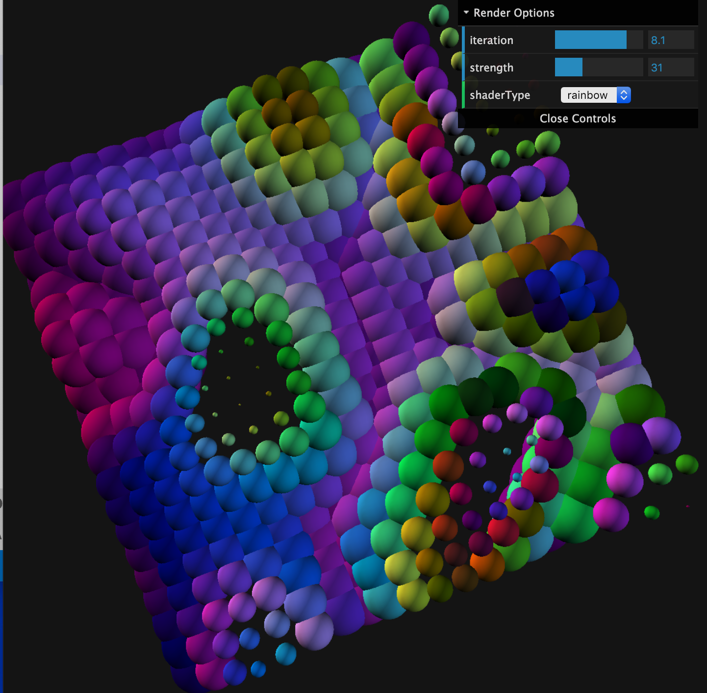

 


# p5js Demo
  My Experiments with p5js using simplex noise on 3d grids and matrix systems.
  You can change the render file called in index.js, each variation
  explores different features in rendering and shader functions. Using dat-gui
  to control display and render options.

  * NEW: http://p5js-flyby.surge.sh/ Flyby Demo - put a nice song on and just watch!

  Current Mapping --> ```index.js``` --> (render file) ```renders\Render.js``` (or just about any other file in src)

  Render - Original Render, initial framework with basic interaction.

## Change Log
  * Updated P5 to 0.7.3 / Webpack 4
  * Optimizations on display, and translation in p5js 3d space.
  * Mouse Down and Drag - to prevent constant movement.
  * AltRender.js - updated render functions.
  * Change Object sphere / box
  * Better Shader Formulas.
  * Mouse rotation and Wheel Zoom.
  * Running on p5js - needing to update render.
  * Initial Commit - Basic formula added for simplexNoise.

## Run the example
  Requires Node and Yarn to be installed for build and development.

  *Open a terminal window and type the following for local webpack dev server...*
  ```bash
  $ yarn install
  $ yarn dev
  ```
  open http://localhost:2020